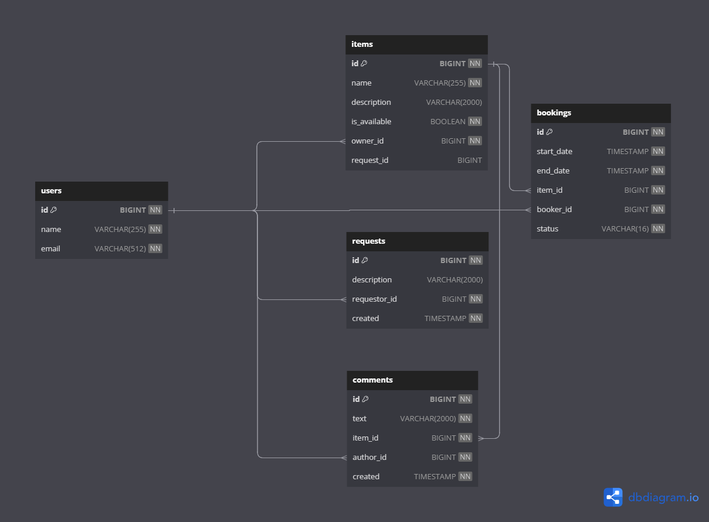

# ShareIt

## Обзор

*ShareIt - это сервис для совместного использования вещей, разбитый на два микросервиса: server и gateway.* 
---
Ниже представлена ER модель хранения данных в данном проекте.
### **База данных:** ###


Приложение предоставляет следующие основные функции:
## Основные функции

- **Добавление предмета**: Пользователи могут добавлять предметы для совместного использования, указывая название,
  описание и статус доступности предмета.

- **Поиск предмета**: Пользователи могут искать доступные предметы для аренды. Если нужный предмет не найден,
  пользователь может оставить запрос на предмет.

- **Бронирование предмета**: Пользователи могут бронировать предмет на определенные даты. Владелец предмета должен
  подтвердить бронирование.

- **Отзывы**: После использования предмета пользователи могут оставлять отзывы, благодаря которым другие пользователи
  могут узнать больше о предмете и его владельце.

- **Просмотр бронирований**: Пользователи могут просматривать текущие, будущие, завершенные, ожидающие подтверждения и
  отклоненные бронирования.

- **Просмотр отзывов**: Пользователи могут просматривать отзывы о предметах.

- **Создание запроса на предмет**: Если пользователь не может найти нужный предмет в сервисе, он может создать запрос на
  предмет. Другие пользователи могут просмотреть этот запрос и, если у них есть этот предмет, они могут добавить его в
  сервис в ответ на запрос.

- **Ответ на запрос предмета**: Пользователи могут добавлять предметы в ответ на запросы других пользователей. При
  добавлении предмета пользователь может указать ID запроса, в ответ на который добавляется предмет.

- **Пагинация**: Добавлена пагинация в следующие эндпоинты: GET /requests/all, GET /items, GET /items/search, GET
  /bookings и GET /bookings/owner. Это помогает повысить производительность и удобство использования приложения, так как
  количество элементов, которые возвращаются в одном ответе, может быть очень большим.

- **Тестирование**: Добавлены юнит-тесты для классов, содержащих нетривиальные методы и условия, а также интеграционные
  тесты, проверяющие взаимодействие с базой данных. Покрыты тестами все REST-эндпоинты приложения с использованием
  MockMVC. Реализованы тесты для слоя репозиториев приложения с использованием аннотации @DataJpaTest.

### Микросервисная архитектура

- **server**: Этот микросервис обрабатывает основную логику приложения, включая взаимодействие с базой данных.

- **gateway**: Этот микросервис работает как точка входа для пользователей. Он выполняет валидацию входящих
  запросов и обеспечивает связь с server через REST. Кэширование также будет реализовано на этом уровне для
  улучшения производительности.

### Деплой приложения с использованием Docker

Приложение теперь можно запустить с использованием Docker. server, gateway и база данных PostgreSQL
каждый запускается в своем собственном Docker-контейнере. Конфигурация между этими контейнерами управляется с помощью
Docker Compose.

## Структура проекта

Проект состоит из двух Maven модулей, каждый из которых представляет собой отдельное приложение: server и
gateway.

### Модуль server:

Включает в себя основную бизнес-логику приложения. Он содержит сервисы, репозитории и сущности, аннотированные для
работы с базой данных через JPA.
Модуль включает в себя контроллеры, сервисы, репозитории и сущности, аннотированные для работы с базой данных через JPA.

- **Контроллеры**: `UserController`, `ItemController`, `BookingController`, `ItemRequestController` обрабатывают запросы
  HTTP и возвращают
  ответы HTTP.

- **Сервисы**: `UserService`, `ItemService`, `BookingService` и `ItemRequestService` обрабатывают основную логику
  приложения.

- **Репозитории**: `UserRepository`, `ItemRepository`, `BookingRepository`, `CommentRepository`
  и `ItemRequestRepository` обеспечивают хранение
  данных в базе данных.

- **Сущности**: `User`, `Item`, `Booking`, `Comment` и `ItemRequest` представляют собой модели данных, аннотированные
  для работы с
  Hibernate и JPA.

### Модуль gateway:

включает в себя контроллеры, обрабатывающие запросы пользователей и выполняющие валидацию входящих данных. Он также
содержит BaseClient для взаимодействия с server через REST.

- **Контроллеры**: `UserController`, `ItemController`, `BookingController`, `ItemRequestController`.

Каждый из этих модулей может быть собран и запущен независимо с помощью Maven и Docker.

## Стэк технологий

### Бэкенд

1. **Java** - основной язык программирования для разработки бэкенд-части приложения.
2. **Spring Boot** - фреймворк для быстрой разработки приложений на Java с минимумом конфигурации.
3. **Hibernate** - ORM фреймворк для работы с базой данных.
4. **JPA (Java Persistence API)** - спецификация Java для управления реляционными данными в приложениях Java.
5. **PostgreSQL** - реляционная система управления базами данных для хранения и обработки данных.
6. **Spring Data JPA** - библиотека, облегчающая работу с JPA, автоматизируя реализацию репозиториев и предоставляя
   множество полезных функций.
7. **JUnit** - библиотека для проведения модульного тестирования приложения.
8. **Mockito** - фреймворк для создания и использования мок-объектов в процессе тестирования.
9. **MockMVC** - библиотека для тестирования Spring MVC контроллеров.
10. **Spring Boot Test** - поддержка тестирования в Spring Boot. Включает в себя настройки для JUnit, Mockito и других
    библиотек для тестирования.

### Дополнительные инструменты

1. **Git** - система контроля версий для отслеживания изменений в исходном коде проекта.
2. **Maven** - инструмент для автоматизации сборки проектов на Java.
3. **Docker** - платформа для автоматизации развертывания, масштабирования и управления приложениями в контейнерах.
4. **Docker Compose** - инструмент для определения и управления многоконтейнерными Docker-приложениями.

## Развертывание приложения

С помощью Docker и Docker Compose приложение теперь может быть развернуто с помощью одной команды:

```shell
docker-compose up
```

После этого приложение будет доступно для доступа пользователями.